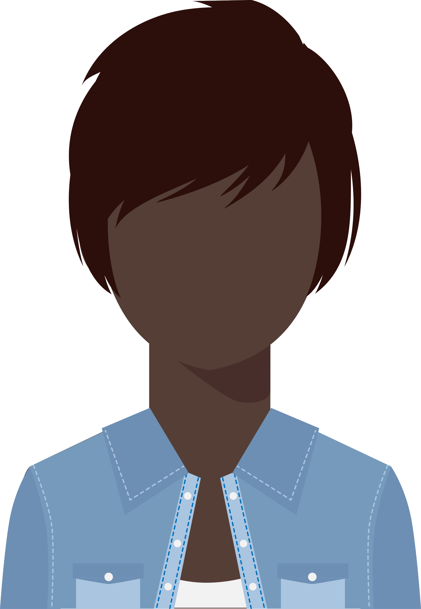

```{r setup, include=FALSE}
library(tufte)
# invalidate cache when the tufte version changes
knitr::opts_chunk$set(tidy = FALSE, cache.extra = packageVersion('tufte'))
options(htmltools.dir.version = FALSE)
```

As you begin to plan your workshop, use these tools to make your job as clear as possible. 

1. Learner Personas (_audience_)
2. Concept Maps (_content_)
3. Learning Objectives (_goal_)

# Learning Objectives

A **learning objective** is the goal of a course or section stated in a way that is:

* clear (a student should be able to understand the objective)

* observable (both you and the student should be able to easily check whether or not they have attained the objective)

Learning objectives can help you 

* identify material to cut 

* ensure cohesion (section objectives should lead to course objective)

* suggest exercises and assessments

Research also shows that students learn better when they clearly understand the objectives of the lesson.

When prompted, write a capstone learning objective for a one day Tidyverse course for our persona.


\pagebreak

# Learner Personas


A learner persona is a short profile of a representative, but perhaps imaginary, student in your class, e.g.:

> "Jean is a professor of Computer Science whose research area is operating systems. She has been teaching undergraduate classes for six years, and believes there has to be a better way. The only training available through her university's teaching and learning center relates to posting assignments and grades in the learning management system, so she wants to find out what else she ought to be asking for."^[Wilson, G. (2018). Teaching Tech Together. http://teachtogether.tech, 2.]

A useful persona should include the student's

1. General background
1. Prior knowledge related to the qubject
1. Motivation or goal(s)
1. How the course will help them
1. Special needs (if any)

When prompted, write three learner personas below (beginner, expert, other), next to whichever faces you like.

```{r echo=FALSE, out.width = "10%"}

```

\vskip 0.2in

```{r echo=FALSE, out.width = "10%"}

```

\vskip 0.2in

```{r echo=FALSE, out.width = "10%"}

```

\vskip 0.2in

```{r echo=FALSE, out.width = "10%"}

```

\vskip 0.2in

```{r echo=FALSE, out.width = "10%"}

```

