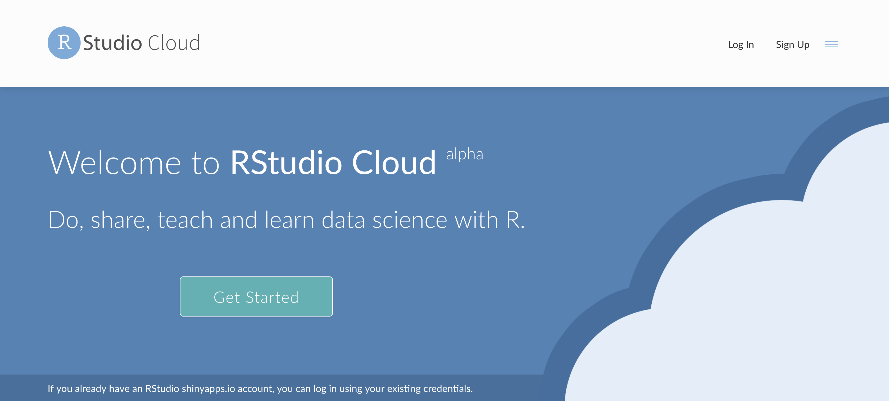
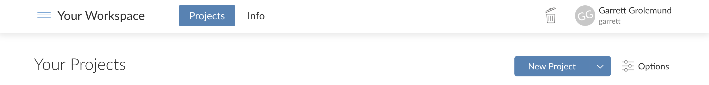

```{r setup, include=FALSE}
library(tufte)
# invalidate cache when the tufte version changes
knitr::opts_chunk$set(tidy = FALSE, cache.extra = packageVersion('tufte'))
options(htmltools.dir.version = FALSE)
```

# Welcome to RStudio Cloud

RStudio Cloud is a free cloud based version of the RStudio IDE. Your students do not need to install any software to use RStudio Cloud; it requires only an internet connection. All of their work is saved to the cloud, which means that your students can come back to their RStudio Cloud projects later, even from a different computer.

```{r echo=FALSE, out.width = "100%"}

```

\smallskip
\smallskip
\smallskip

To log into RStudio Cloud, visit http://rstudio.cloud and click the log in button in the top right corner.^[If this is your first visit, click the Sign Up button.] You can login with:

1. Your google account
1. Your Github Account
1. Your shinyapps.io account
1. An RStudio Cloud account

# Getting Started

All of RStudio Cloud's features are documented in a user friendly guide that can be accessed by opening the sidebar of your RStudio Cloud home page, which is also known as _Your Workspace_.^[Click the `r knitr::include_graphics("images/menu.png")` icon in the top left corner to open the sidebar. Then click the link that says Guide.]

\smallskip
\smallskip
\smallskip
\smallskip
\smallskip

```{r echo=FALSE, out.width = "100%"}

```

# Get to know RStudio Cloud

Read the RStudio Cloud guide and use it to complete the challenges below. Use this sheet to jot down useful notes and reminders.

\pagebreak

A _________ is the fundamental unit of work in RStudio Cloud. Circle the items that are saved with a _________.

1. The packages that you have installed.
1. The files that you have saved.
1. The history of commands that you have run.
1. All of the above.

\vskip 0.1in

All of your projects are stored in an area known as _________. This is your home page in RStudio Cloud.

\vskip 0.1in

To create a new project, click the __________ button on this screen.

\vskip 0.1in

You can share a copy of a project with someone else by (_circle one_: sending them an invite / sending them the project URL). They will receive access to (_circle one_: your original project, which they can edit / a temporary copy of your project in its current state, which they can save as a permanent copy). You can share (_circle one_: any project as is / only projects that you make visible to everyone).

\vskip 0.1in

Do shared projects track changes made in the original project? Yes/No.

\vskip 0.1in

A ________ is a repository of projects that are only visible to you and the members that you invite.

\vskip 0.1in

Each member of a space receives a role. _______ and _______ can open any project in a private space and directly modify it. This is the only way to directly modify someone else's project in RStudio Cloud.

\vskip 0.6in

1. Find the cheatsheet that corresponds to your package lesson. Open it.

\vskip 0.6in

2. Find the Primer that corresponds to your package lesson. Scan its contents.

\vskip 0.6in

3. Make a new project that you will use to save and share the exercises for your package lesson.